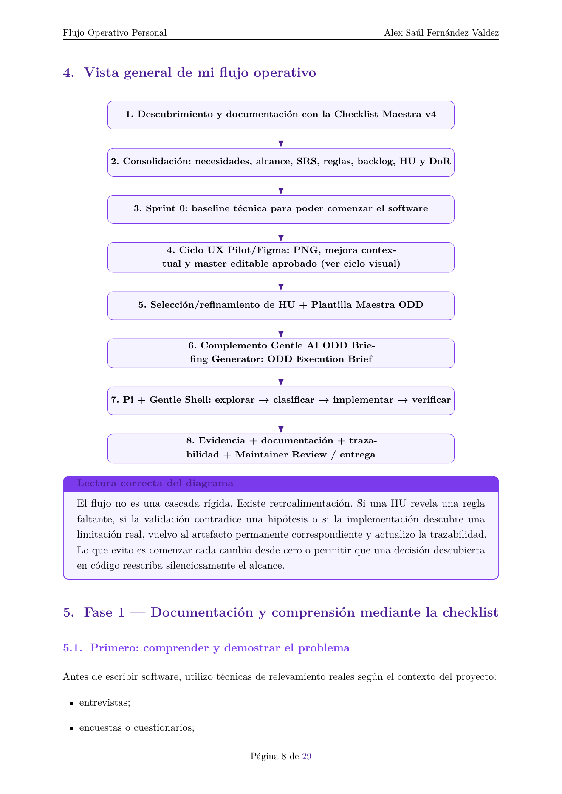
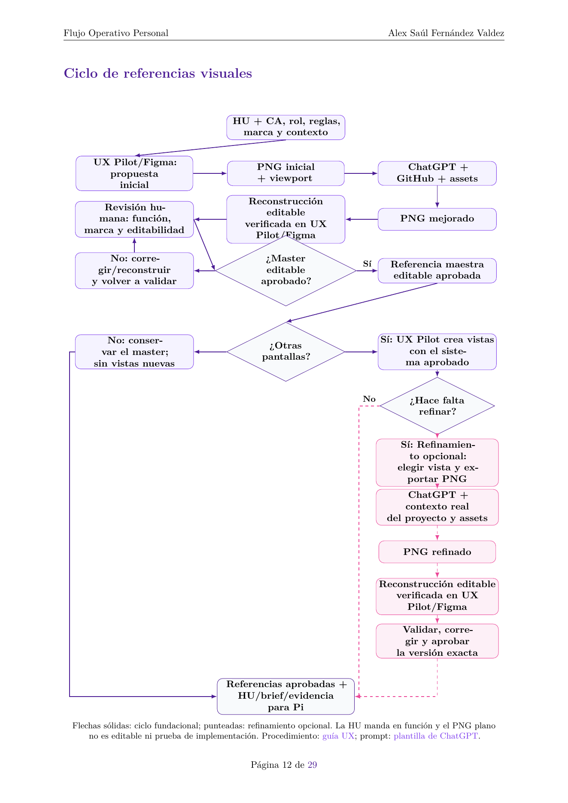

# Flujo Operativo Personal para Proyectos Universitarios de Software

Este repositorio documenta el flujo personal de Alex Saúl Fernández Valdez: comprender y documentar el problema con la Checklist Maestra v4, preparar una base técnica, establecer referencias visuales UX aprobadas, convertir cada historia de usuario en un handoff ODD y ejecutar el trabajo con Pi/Gentle Shell sobre evidencia del repositorio. ODD es aquí el flujo de ejecución; no reemplaza el proceso universitario completo.

## Documento y vista previa

**[Abrir o descargar el PDF completo (30 páginas)](docs/flujo-operativo/rendered/flujo-operativo-proyectos-universitarios-alex.pdf)**

Las dos imágenes son vistas previas PNG reales de las páginas de diagramas del PDF. Cuando estos archivos se publiquen en GitHub, el enlace al PDF no incrustará sus páginas como imagen; las vistas PNG se mostrarán por separado.

## El flujo, de principio a fin

1. **Comprender antes de construir.** Usar la Checklist Maestra para pasar de evidencia y hallazgos a necesidades, objetivos, alcance, requisitos y reglas. No presentar evidencia hipotética como real.
2. **Preparar la base técnica.** Sprint 0 es una adaptación personal para habilitar el desarrollo incremental, no una fase para construir de antemano toda la plataforma.
3. **Preparar y aprobar referencias visuales.** Después del análisis y Sprint 0, sigue el [ciclo visual UX](docs/ux/flujo-referencias-visuales.md): UX Pilot/Figma inicial → PNG → ChatGPT con el GitHub, la documentación, el frontend y los assets realmente accesibles → PNG mejorado → reconstrucción editable verificada en UX Pilot/Figma → aprobación humana del master. Las pantallas posteriores siguen el sistema aprobado; el refinamiento posterior es opcional. La HU y sus reglas mandan ante conflictos funcionales; identidad/assets oficiales y tokens/kit, junto con el master editable aprobado, prevalecen sobre PNG intermedios.
4. **Refinar una HU.** Revisar criterios, reglas, dependencias y DoR; usar la plantilla para reunir el contexto que necesita el handoff y enlazar la referencia aprobada.
5. **Preparar el ODD Execution Brief.** El complemento personal Gentle AI ODD Briefing Generator organiza la intención y los límites. No debe inventar rutas ni el plan técnico.
6. **Explorar y ejecutar con Pi/Gentle Shell.** Pi deriva el trabajo técnico desde el repositorio actual; clasifica el cambio, lo sigue de forma recuperable si es sustancial, implementa y verifica con evidencia observada.
7. **Cerrar con trazabilidad.** Alinear pruebas, evidencias y documentación permanente; detenerse en Maintainer Review cuando corresponda. Commit, publicación remota y despliegue son autorizaciones separadas.

El flujo admite retroalimentación: un hallazgo de implementación o validación puede requerir volver al requisito, regla o HU correspondiente, sin ampliar el alcance por defecto.

## Responsabilidades y handoffs

| Participante o artefacto | Aporta / salida | Límite |
|---|---|---|
| UX Pilot/Figma | Propuesta inicial y reconstrucción editable verificada; pantallas posteriores coherentes con el master. | Una propuesta no es aprobación; un componente Figma no es código frontend. |
| PNG | Referencia visual inicial, mejorada o refinada por viewport. | Raster plano no es editable ni prueba interacción, responsive o implementación. |
| ChatGPT | PNG mejorado con el contexto real del proyecto que pudo consultar. | Declara límites de acceso; no edita el repositorio ni certifica código o editabilidad. |
| Alex, responsable del proyecto | Compara, corrige y aprueba la versión editable exacta; decide producto, alcance y delivery. | La aprobación visual no sustituye la verificación técnica. |
| Checklist v4 y documentación del proyecto | Cobertura para problema, requisitos, backlog, pruebas y trazabilidad. | Se adapta a la consigna y al contexto; no todo elemento aplica siempre. |
| Plantilla y complemento de briefing | Transfieren intención, restricciones, fuentes y aceptación en un ODD Execution Brief. | No inspeccionan ni describen por adelantado la arquitectura real. |
| Pi + Gentle Shell | Inspeccionan por separado repositorio, código, contratos y pruebas; derivan, implementan y verifican el trabajo. | La referencia visual no prueba implementación; Pi no decide alcance ni autoriza delivery remoto. |

## Rutas de lectura

- **Entender el proceso personal:** recorre este README y luego el [documento completo](docs/flujo-operativo/rendered/flujo-operativo-proyectos-universitarios-alex.pdf); la fuente editable es el [archivo LaTeX](docs/flujo-operativo/flujo-operativo-proyectos-universitarios-alex.tex).
- **Ubicar cada fuente y distinguir las capas:** consulta el [índice de documentación y referencias](docs/README.md).
- **Reconstruir el PDF y las vistas previas:** sigue la [guía de renderizado](docs/RENDERING.md).
- **Preparar referencias visuales:** sigue la [guía del ciclo UX](docs/ux/flujo-referencias-visuales.md) y copia la [plantilla autónoma de ChatGPT](docs/ux/plantilla-chatgpt-mejora-referencias-visuales.md). La guía es el procedimiento; el prompt solicita el PNG mejorado y declara el contexto realmente accesible.
- **Preparar una HU:** lee la [Checklist Maestra v4](docs/flujo-operativo/referencias/checklist-maestra-universal-proyectos-universitarios-v4.md), enlaza el master editable aprobado si existe y completa la [plantilla del ODD Briefing Generator](docs/flujo-operativo/referencias/plantilla-maestra-odd-briefing-generator.md); después consulta las referencias Gentle AI v4 desde el índice.
- **Consultar el flujo operativo completo:** abre el [PDF](docs/flujo-operativo/rendered/flujo-operativo-proyectos-universitarios-alex.pdf), su [fuente editable](docs/flujo-operativo/flujo-operativo-proyectos-universitarios-alex.tex), las vistas PNG del [diagrama general](docs/flujo-operativo/rendered/diagrama-flujo-operativo-pagina-09.png) y el [ciclo UX](docs/flujo-operativo/rendered/diagrama-ciclo-referencias-visuales-pagina-13.png), o la [guía de renderizado](docs/RENDERING.md).

## Publicación y atribución

La publicación del nombre completo de **Alex Saúl Fernández Valdez** y del icono original del complemento fue autorizada expresamente por el autor. Esta autorización concreta no establece una licencia general para redistribuir o reutilizar todos los materiales del repositorio. Se conserva la atribución original; las referencias Gentle AI v4 no implican afiliación ni aval oficial de sus autores. No se declara aquí una licencia general ni una instalación, integración o garantía operativa de las herramientas mencionadas.
