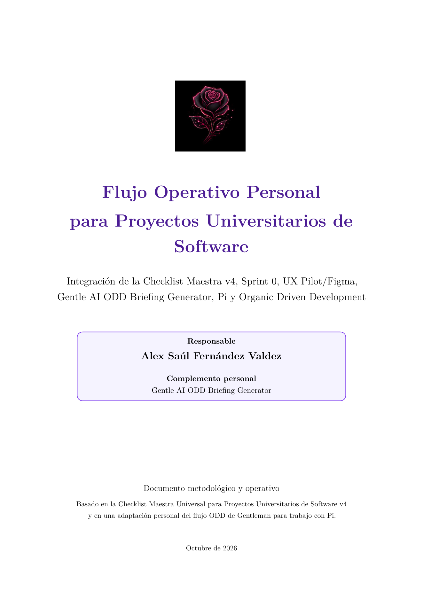
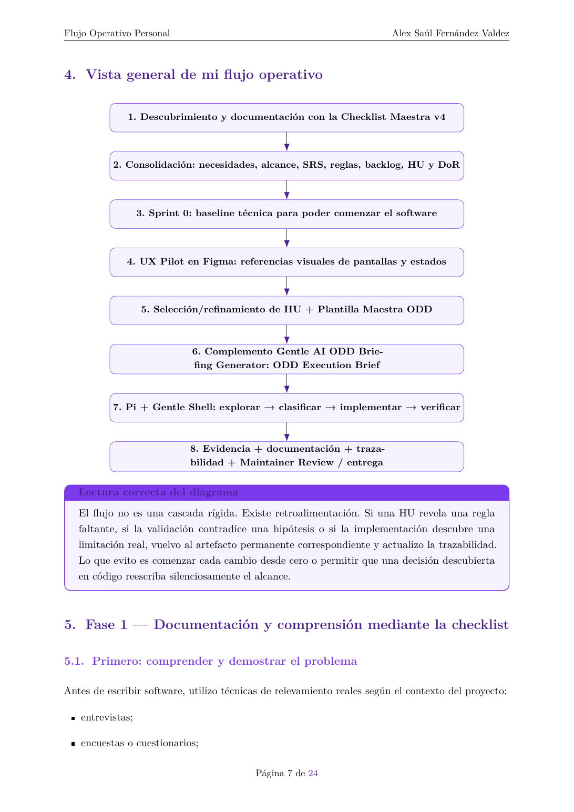

# Flujo Operativo Personal para Proyectos Universitarios de Software

Este repositorio documenta el flujo personal de Alex Saúl Fernández Valdez: comprender y documentar el problema con la Checklist Maestra v4, preparar una base técnica y referencias UX, convertir cada historia de usuario en un handoff ODD y ejecutar el trabajo con Pi/Gentle Shell sobre evidencia del repositorio. ODD es aquí el flujo de ejecución; no reemplaza el proceso universitario completo.

## Documento y vista previa

**[Abrir o descargar el PDF completo (25 páginas)](docs/flujo-operativo/rendered/flujo-operativo-proyectos-universitarios-alex.pdf)**

Las imágenes son vistas previas PNG reales del PDF. Cuando estos archivos se publiquen en GitHub, el enlace al PDF no incrustará sus páginas como imagen; las vistas PNG se mostrarán por separado.

## El flujo, de principio a fin

1. **Comprender antes de construir.** Usar la Checklist Maestra para pasar de evidencia y hallazgos a necesidades, objetivos, alcance, requisitos y reglas. No presentar evidencia hipotética como real.
2. **Preparar la base técnica.** Sprint 0 es una adaptación personal para habilitar el desarrollo incremental, no una fase para construir de antemano toda la plataforma.
3. **Preparar la intención visual.** UX Pilot/Figma aporta referencias de pantallas y estados una vez que problema y alcance tienen contexto. Una maqueta no autoriza funciones nuevas.
4. **Refinar una HU.** Revisar criterios, reglas, dependencias y DoR; usar la plantilla para reunir el contexto que necesita el handoff.
5. **Preparar el ODD Execution Brief.** El complemento personal Gentle AI ODD Briefing Generator organiza la intención y los límites. No debe inventar rutas ni el plan técnico.
6. **Explorar y ejecutar con Pi/Gentle Shell.** Pi deriva el trabajo técnico desde el repositorio actual; clasifica el cambio, lo sigue de forma recuperable si es sustancial, implementa y verifica con evidencia observada.
7. **Cerrar con trazabilidad.** Alinear pruebas, evidencias y documentación permanente; detenerse en Maintainer Review cuando corresponda. Commit, publicación remota y despliegue son autorizaciones separadas.

El flujo admite retroalimentación: un hallazgo de implementación o validación puede requerir volver al requisito, regla o HU correspondiente, sin ampliar el alcance por defecto.

## Responsabilidades y handoffs

| Participante o artefacto | Aporta / recibe | Límite |
|---|---|---|
| Alex, responsable del proyecto | Decide producto, alcance, riesgo y permisos de entrega; valida resultados. | La automatización no sustituye su autoridad. |
| Checklist v4 y documentación del proyecto | Cobertura para problema, requisitos, backlog, pruebas y trazabilidad. | Se adapta a la consigna y al contexto; no todo elemento aplica siempre. |
| UX Pilot/Figma | Referencia visual para la HU y la implementación. | No es por sí sola una especificación funcional ni amplía el alcance. |
| Plantilla y complemento de briefing | Transfieren intención, restricciones y aceptación en un ODD Execution Brief. | No inspeccionan ni describen por adelantado la arquitectura real. |
| Pi + Gentle Shell | Exploran el repositorio, derivan trabajo técnico, implementan y verifican. | No deciden el alcance ni autorizan delivery remoto. |

## Rutas de lectura

- **Entender el proceso personal:** recorre este README y luego el [documento completo](docs/flujo-operativo/rendered/flujo-operativo-proyectos-universitarios-alex.pdf); la fuente editable es el [archivo LaTeX](docs/flujo-operativo/flujo-operativo-proyectos-universitarios-alex.tex).
- **Ubicar cada fuente y distinguir las capas:** consulta el [índice de documentación y referencias](docs/README.md).
- **Reconstruir el PDF y las vistas previas:** sigue la [guía de renderizado](docs/RENDERING.md).
- **Preparar una HU:** lee la [Checklist Maestra](docs/flujo-operativo/referencias/checklist-maestra-universal-proyectos-universitarios-v4.md) y la [plantilla del ODD Briefing Generator](docs/flujo-operativo/referencias/plantilla-maestra-odd-briefing-generator.md); después consulta las referencias Gentle AI v4 desde el índice.

## Publicación y atribución

La publicación del nombre completo de **Alex Saúl Fernández Valdez** y del icono original del complemento fue autorizada expresamente por el autor. Esta autorización concreta no establece una licencia general para redistribuir o reutilizar todos los materiales del repositorio. Se conserva la atribución original; las referencias Gentle AI v4 no implican afiliación ni aval oficial de sus autores. No se declara aquí una licencia general ni una instalación, integración o garantía operativa de las herramientas mencionadas.
