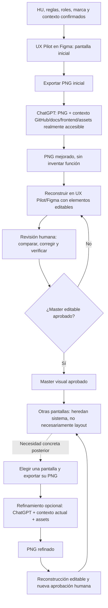

# Flujo personal de referencias visuales para UX

Esta guía define cómo transformar una referencia inicial de pantalla en un **master editable aprobado** y usarlo para orientar pantallas posteriores. La imagen mejorada ayuda a diseñar; no autoriza funciones, no demuestra que el código exista y no sustituye la aprobación humana.

Para ejecutar la etapa de ChatGPT, copia la [plantilla autónoma para mejorar referencias visuales](plantilla-chatgpt-mejora-referencias-visuales.md). Esta guía es el procedimiento principal; la plantilla operacionaliza una solicitud y no la reemplaza.

## Ruta rápida

1. Completa la Checklist, investigación, requisitos/reglas y Sprint 0; identifica la HU, los roles y el objetivo de la pantalla.
2. En UX Pilot dentro de Figma, crea la pantalla inicial con ese contexto. Considérala una propuesta, no el master por defecto.
3. Exporta la pantalla a PNG y pide a ChatGPT una mejora estética informada por el contexto real del proyecto que pueda leer.
4. Reconstruye la imagen aprobable como objetos editables en UX Pilot/Figma; no aceptes un PNG plano dentro de un frame como reconstrucción.
5. Compara, corrige y aprueba explícitamente el master editable.
6. Diseña otras pantallas siguiendo su sistema visual, pero con composición apropiada a cada objetivo funcional.
7. Más adelante, si hace falta, aplica el refinamiento dirigido opcional a una pantalla concreta y vuelve a aprobarla.
8. Conserva la trazabilidad y entrega el vínculo/versionado de Figma junto con los PNG y fuentes realmente consultados.

## 1. Ubicación y propósito dentro del flujo

Este ciclo se ubica **después de la Checklist, investigación/relevamiento, requisitos y reglas, y Sprint 0, pero antes del handoff de cada HU a Pi**. Debe existir suficiente contexto funcional y técnico para que la referencia no invente el producto. La HU, sus criterios de aceptación (CA), los roles, las reglas y las restricciones relevantes deben estar identificados antes de diseñar la pantalla asociada.

El ciclo no sustituye los entregables de análisis ni obliga a generar una pantalla para cada HU. Selecciona una pantalla representativa y útil para establecer el sistema visual; después crea las vistas que el backlog realmente necesite. UX Pilot/Figma ofrece una referencia visual complementaria, no una fuente de requisitos ni una autorización para ampliar alcance.

## 2. Entradas y contexto

Prepara sólo el contexto relevante para la pantalla. Distingue hechos aprobados, referencias, supuestos y preguntas pendientes.

| Entrada | Qué aportar | Regla de uso |
|---|---|---|
| Proyecto y pantalla | Nombre/tipo de proyecto, descripción, objetivo de la vista, audiencia, HU, rol, estado de la HU y vista/viewport. | No inferir necesidades que no estén en los requisitos o en una decisión aprobada. |
| Función | Flujo, información que debe mostrarse, acciones aprobadas, CA, reglas, permisos, estados y restricciones. | La función aprobada limita todo cambio visual. No añadir acciones, datos, módulos ni estados. |
| Marca y sistema visual | Logo oficial y variantes autorizadas, paleta, tipografías, iconos, ilustraciones, fotografías, tokens, kit y pantallas aprobadas. | Prioriza assets auténticos y fuentes existentes. No deformes el logo ni sustituyas identidad por una marca ajena. |
| Repositorio y documentación | Enlace GitHub si existe, propietario, rama o commit, README, docs de UX/HU/CA, frontend y assets relevantes. | Sólo afirma haber leído lo que estuvo realmente accesible. Registra referencia y rutas consultadas; revela límites de acceso. |
| Referencias visuales | PNG inicial, capturas, links o frames de Figma, versiones anteriores y comentarios. | Identifica cuál es actual, aprobada, intermedia o sólo inspiracional; no resuelvas contradicciones por intuición. |
| Entrega de imagen | PNG requerido, resolución/aspecto, orientación, viewport (desktop/tablet/mobile), elementos a preservar/mejorar y prohibiciones. | El PNG debe ser una imagen real entregada por la herramienta disponible, no una descripción que se presente como archivo. |

No compartas secretos ni datos personales reales. Usa datos de muestra claramente ficticios cuando la maqueta necesite contenido; no presentes esos valores como datos del proyecto.

## 3. Ciclo principal y refinamiento opcional



La flecha punteada indica una rama **opcional**: no hay que repetir generación sin una necesidad concreta. Si una etapa posterior revela una contradicción material de función, marca o referencia, detén esa decisión visual y consulta a la persona responsable; no conviertas una discrepancia menor de composición en una pregunta bloqueante.

### A. Crear la primera pantalla en UX Pilot/Figma

Parte de la HU, rol, reglas, estructura funcional, estado, marca y contexto disponibles. La primera propuesta de UX Pilot no es automáticamente el master: puede tener una composición, contenido visual o decisiones de estilo que deban corregirse. Marca claramente lo confirmado y lo provisional.

### B. Exportar PNG y solicitar mejora contextual

Exporta el frame como PNG en el viewport/aspecto pedido. Entrega ese PNG a ChatGPT junto con la información que realmente pueda consultar: repositorio GitHub conectado, rama/commit, documentación, frontend, assets y referencias visuales. Si una conexión no está disponible, declara esa limitación y proporciona extractos/archivos permitidos o trabaja sólo con lo adjunto. No afirmes haber accedido al repositorio ni inventes contenido, archivos o rutas.

ChatGPT debe producir como salida principal un PNG visualmente mejorado para la pantalla y viewport solicitados, respetando la función aprobada. Una explicación escrita sin el PNG solicitado no sustituye esa salida. Si no dispone de una capacidad real para generar/adjuntar imágenes, debe decirlo y no simular un archivo.

### C. Reconstruir el PNG como diseño editable

Lleva la referencia mejorada a UX Pilot/Figma usando las capacidades que ofrezca la versión disponible. La reconstrucción puede requerir recrear textos, formas, imágenes, estilos y componentes manualmente. **No se garantiza una conversión semántica perfecta ni de un clic**: verifica y corrige cada elemento. Un frame que contiene sólo el PNG aplanado no es un master editable y debe rechazarse como resultado final.

### D. Comparar y aprobar el master

Una persona compara el PNG inicial, el mejorado y la reconstrucción editable; corrige lo necesario y aprueba explícitamente el master editable. Revisa al menos:

- fidelidad a la función, rol, CA, reglas, acciones, información y estados aprobados;
- editabilidad real de texto, formas, imágenes y propiedades, sin una captura plana como única capa;
- componentes reutilizables, instancias del kit cuando apliquen y uso coherente de estilos/tokens;
- tipografía, colores, contraste, jerarquía, espacio, alineación, recorte y legibilidad;
- integridad y proporciones del logo, marca, iconos, assets, tono y contenido de ejemplo;
- navegación, formularios, tablas, tarjetas y estados necesarios para la vista;
- vista(s) solicitada(s), consistencia con el master y aspectos de adaptación responsive.

La aprobación tiene que identificar la versión/frame exactos, responsable y fecha. Una PNG estática por sí sola **no certifica** accesibilidad, responsive, interacción, comportamiento ni conformidad de la UI implementada. Esos aspectos requieren comprobaciones apropiadas en prototipo, dispositivo, navegador, código o pruebas según corresponda.

### E. Diseñar pantallas adicionales

Después de aprobar el master, crea las otras pantallas que el flujo funcional requiera. Heredan la marca, tokens, tipografía, componentes, jerarquía y convenciones aprobados, pero su distribución debe responder al objetivo, datos, rol y estado de cada pantalla. No dupliques el mismo layout si perjudica el flujo ni crees un sistema visual independiente sin motivo.

### F. Refinamiento dirigido posterior (opcional)

Sólo si una pantalla concreta necesita una mejora adicional, exporta su PNG actual y usa ChatGPT con el contexto vigente del repositorio, docs, frontend y assets que sean realmente accesibles. Obtén otro PNG, reconstruye esa variante como diseño editable y sométela a comparación y aprobación humana. Luego intégrala a la familia visual aprobada y retorna al trabajo de pantallas. No es una obligación periódica ni una segunda vuelta automática de todas las vistas.

## 4. Qué significa “editable”

No confundas artefactos de niveles distintos:

| Nivel | Significado | No demuestra |
|---|---|---|
| Capas editables | Texto, vectores, imágenes y propiedades separados y modificables en el archivo de diseño. | Que existan componentes reutilizables o que el frontend esté implementado. |
| Componentes reutilizables de Figma | Componentes/variantes definidos en el documento de diseño para repetir patrones. | Que sean componentes de código o que el kit tenga instancias correctas. |
| Instancias de un kit | Uso de componentes de una librería UI/design kit dentro del diseño, cuando la librería existe y resulta compatible. | Que la aplicación use esa librería o que el componente funcione en runtime. |
| Componentes reales del frontend | Código y comportamiento dentro de la aplicación, comprobables en el repositorio y la ejecución. | No pueden inferirse de una imagen o frame de Figma. |

Un diseño puede tener capas editables sin tener componentes reutilizables; un componente de Figma no es un componente frontend. No declares que una pantalla está implementada, que usa un kit o que es totalmente editable sin evidencia del artefacto correspondiente.

## 5. Autoridad y resolución de conflictos

La autoridad depende de la dimensión:

1. **Funcional:** decisiones humanas aprobadas, HU vigente, CA, SRS y reglas de negocio. Una referencia visual nunca puede cambiar o ampliar esa función; si contradice una decisión aprobada, prevalece la función.
2. **Marca y diseño:** identidad/activos oficiales aprobados y contexto de marca, luego tokens/kit/convenios del proyecto, luego master y pantallas aprobadas, y finalmente PNG intermedios o referencias inspiracionales.
3. **Realidad técnica:** ChatGPT puede aprovechar sólo el contexto visible que consultó. Pi debe inspeccionar de forma independiente el repositorio, código, contratos, pruebas y documentación actual para determinar qué existe y qué trabajo implica.

Si dos referencias visuales difieren, identifica su fecha, estado y aprobación. Detén sólo cuando quede una incertidumbre material que pueda cambiar función, marca, permiso, alcance o aceptación; plantea una pregunta concreta. Para ajustes estéticos menores, elige una solución compatible, señala la suposición y permite revisión humana. Ni el PNG ni el master prueban implementación ni reemplazan pruebas/evidencia.

## 6. Calidad, accesibilidad y límites de una imagen

Antes de aprobar, revisa la composición al tamaño de uso y con acercamiento: texto sin distorsión ni recorte; logo sin alteración; fuentes disponibles o alternativas claramente indicadas; contraste y jerarquía legibles; separación, alineación y espaciado consistentes; contenido sin duplicados; controles, estados y permisos coherentes con la HU. Comprueba las variantes de viewport que sean necesarias, no sólo una captura de escritorio.

Una imagen estática no permite verificar navegación por teclado, semántica, foco, interacción, comportamiento responsive, estados reales, contraste efectivo en todos los contextos, asistencia tecnológica ni conformidad implementada. Usa pruebas adicionales apropiadas. No afirmes cumplimiento de accesibilidad, calidad responsive, fidelidad perfecta de assets ni conexión exitosa a GitHub basándote sólo en el PNG.

## 7. Handoff y evidencia

Antes de entregar la HU a Pi, proporciona un handoff breve que enlace la función aprobada y el diseño visual sin mezclarlos. Incluye:

- HU/CA/rol/estado y objetivo de pantalla; decisiones funcionales y límites;
- vínculo estable al proyecto, página/frame y versión aprobada de Figma; responsable y fecha de aprobación;
- PNG inicial y PNG mejorado, identificados por etapa y viewport;
- fuentes, assets y referencias realmente usados, con GitHub owner/repositorio/rama/commit y rutas consultadas cuando estuvieron disponibles;
- estado de reconstrucción: capas verificadas, componentes/kit efectivamente identificados, diferencias conocidas y límites de acceso;
- instrucción funcional inequívoca: seguir la HU y las reglas; usar el master sólo como autoridad visual; no inferir menús, controles ni capacidades no confirmados;
- aspectos pendientes de verificación responsive/accesibilidad/interacción y evidencia requerida más adelante.

Indica a Pi que inspecte por su cuenta código, contratos y pruebas: el handoff visual no es prueba de implementación. Preserva sólo evidencia útil y localizable; no dupliques infraestructura documental ni mantengas copias divergentes.

### Convención ilustrativa de versiones

Adapta los nombres, formatos y ubicación a las convenciones del proyecto destino; los siguientes son ejemplos, no rutas obligatorias:

- PNG: `HU-XXX-[vista]-[etapa]-[viewport]-v01.png` (`inicial`, `mejorado` o `refinamiento`).
- Frame: `HU-XXX — [vista] — [viewport] — v01`.
- Evidencia: vínculo al frame y versión exactos de Figma, fecha, aprobador y lista breve de fuentes/limitaciones.

Usa IDs/versiones estables y conserva el vínculo al Figma correcto. No llames “final” a una imagen que todavía no tiene aprobación humana. No inventes nombres de menús o botones de Figma: describe el resultado requerido y usa las funciones presentes en la versión instalada.

## 8. Trazabilidad mínima

Mantén una cadena comprensible, enlazando artefactos existentes en vez de duplicar su contenido:

```text
HU / CA / reglas
  → UX de la vista
  → PNG inicial
  → PNG mejorado + fuentes, referencias y assets consultados
  → reconstrucción editable + revisión y aprobación humana
  → master visual aprobado
  → brief/handoff de la HU
  → inspección e implementación de código
  → pruebas y evidencia observada
```

Cada pantalla posterior referencia el master y su HU/objetivo propios. Si se refina una pantalla, conserva la relación con la versión previa y registra la nueva aprobación. Un cambio de requisitos o regla requiere actualizar la fuente funcional correspondiente, no corregir sólo la imagen.

## 9. Antipatrones que se deben evitar

1. Entregar un PNG plano dentro de un frame y llamarlo reconstrucción editable.
2. Confundir capas editables con componentes reutilizables de Figma.
3. Confundir instancias de un kit con componentes frontend reales.
4. Crear sistemas visuales independientes para cada pantalla.
5. Reutilizar la misma composición aunque no corresponda al objetivo de la vista.
6. Declarar master a la primera propuesta de UX Pilot sin comparación ni aprobación.
7. Afirmar acceso a GitHub o lectura de rutas que en realidad no estuvieron disponibles.
8. Inventar branding, paleta, assets o contexto cuando no se proporcionaron ni verificaron.
9. Agregar funciones, acciones, módulos, permisos, campos, datos o estados no autorizados.
10. Alterar o sustituir el logo oficial, sus proporciones/geometría, o copiar una marca ajena sin autorización.
11. Usar etiquetas confusas, datos ficticios presentados como reales o información no confirmada.
12. Repetir generación/refinamiento o crear pantallas sin una necesidad concreta.
13. Ignorar accesibilidad o responsive porque el PNG parece correcto en un único viewport.
14. Afirmar que la imagen certifica accesibilidad, comportamiento o conformidad del frontend.
15. Perder la procedencia del PNG, los assets, el commit, la versión o la aprobación.
16. Mantener referencias contradictorias o llamar vigente a un master superseded.
17. Duplicar el procedimiento en varios documentos hasta que diverjan, o conservar enlaces/nombres a una versión canónica obsoleta.

## 10. Ejemplo conceptual (no ejecutado)

Una HU hipotética solicita que un rol autorizado consulte solicitudes pendientes. El PNG inicial muestra una tabla y una acción de revisión. ChatGPT puede ajustar jerarquía, espaciado, contraste y legibilidad usando sólo el repo/docs/assets que realmente lea. Si la HU no autoriza filtros, la mejora no debe inventarlos. La persona responsable reconstruye los elementos editables, verifica el contenido y aprueba la versión exacta como master. Una pantalla de detalle posterior hereda tipografía, color y componentes, pero adopta una composición de detalle adecuada. Este ejemplo sólo explica el método: aquí no se generaron pantallas, PNG ni archivos Figma.

## 11. Gobierno de estos documentos

Esta guía es la fuente principal de procedimiento. La [plantilla de ChatGPT](plantilla-chatgpt-mejora-referencias-visuales.md) debe mantenerse autónoma para copiar, coherente con las reglas anteriores y no convertirse en una segunda guía divergente. Otros documentos pueden resumir el flujo y enlazar aquí; no deben replicar íntegramente sus pasos. La disponibilidad, capacidades y nombres de controles de herramientas externas pueden variar: describe resultados verificables, no garantías de integración o conversión.
